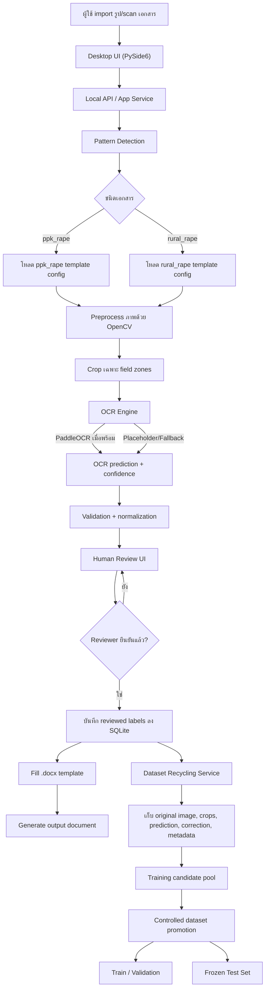
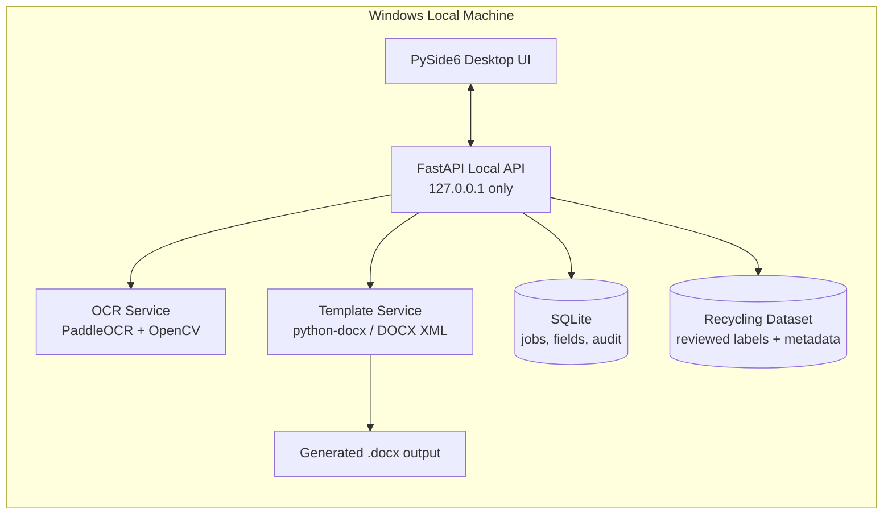
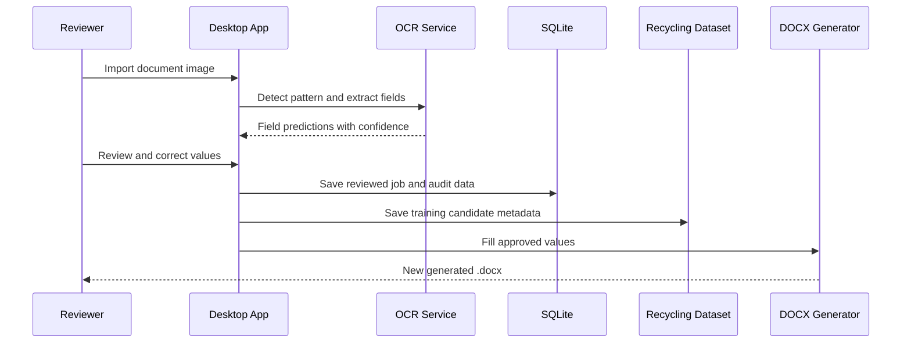

# Architecture Flow

เอกสารนี้สรุป flow หลักของ Rape OCR MVP ตั้งแต่ import เอกสารจนถึง export `.docx`
และ recycling dataset สำหรับเทรนต่อ

## End-to-End Workflow

## Local Component Diagram

## Review and Training Loop

## ขอบเขตข้อมูลที่ต้องระวัง

- `data/`, `output/` และ `docs/example/` เป็นข้อมูล local/runtime หรือไฟล์ตัวอย่าง
  ที่อาจมีข้อมูลอ่อนไหว จึงไม่ควร commit ขึ้น remote
- ค่าที่ใช้ train ต่อควรมาจาก human-reviewed label เท่านั้น
- ห้ามนำ recycling data เข้า frozen test set แบบอัตโนมัติ

