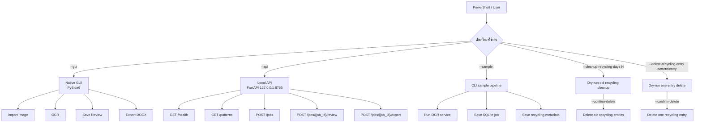
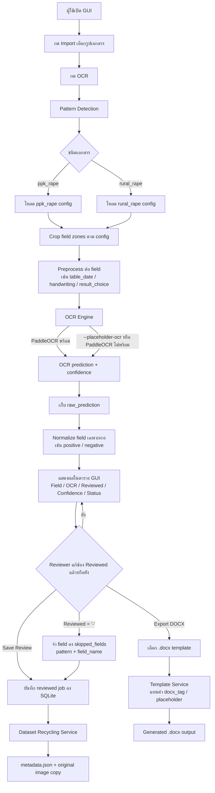
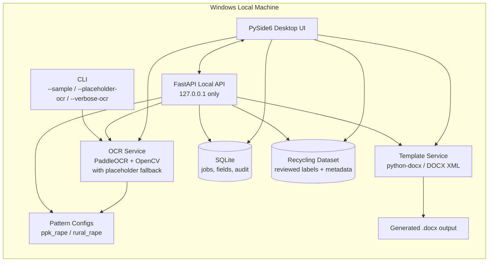
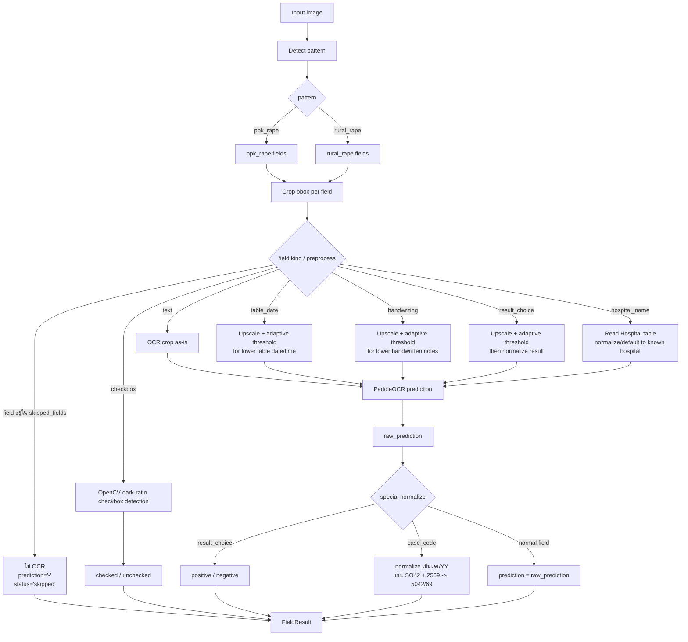
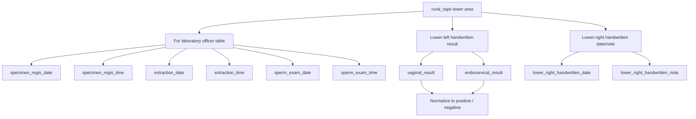
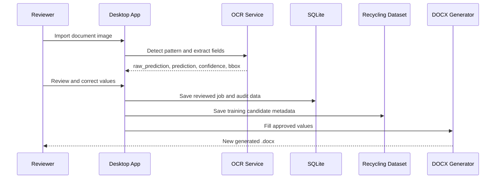
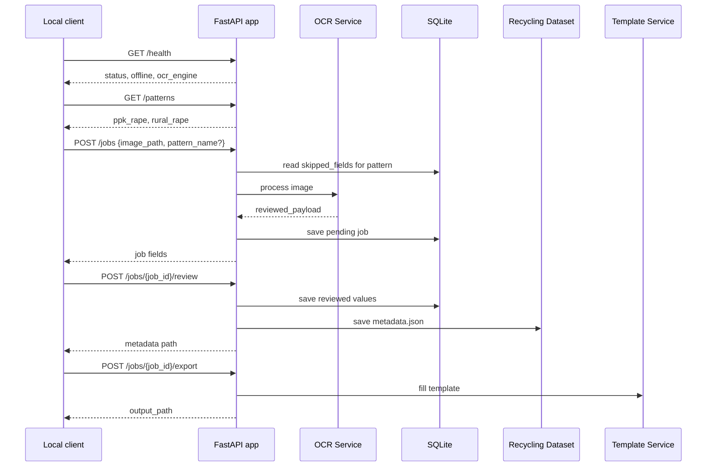
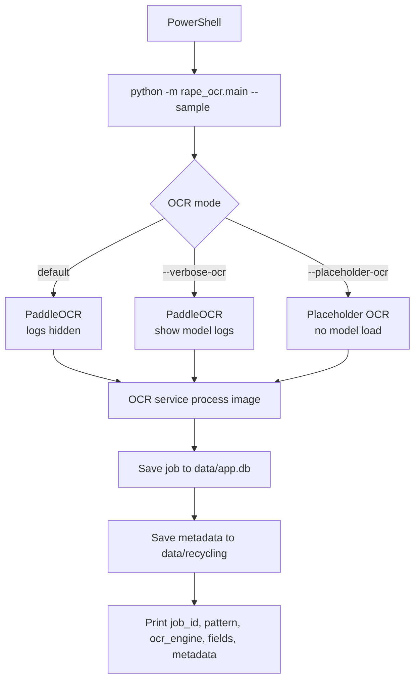
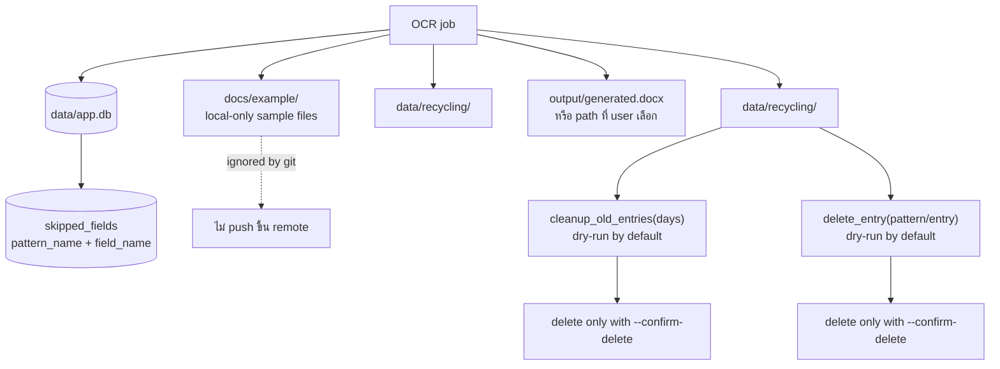
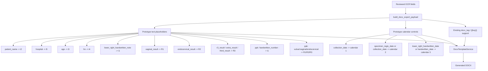

# Architecture Flow

เอกสารนี้สรุป flow ทั้งหมดที่มีใน Rape OCR app ปัจจุบัน ตั้งแต่ทางเข้าแบบ GUI,
CLI และ Local API ไปจนถึง OCR, human review, DOCX export และ recycling dataset
สำหรับเทรนต่อ

## App Entry Points

## End-to-End GUI Workflow

## Local Component Diagram

## OCR Field Extraction Flow

## Rural Lower Fields

## Review and Training Loop

## API Flow

## CLI Flow

## Storage and Output Paths

## ขอบเขตข้อมูลที่ต้องระวัง

- `data/`, `output/` และ `docs/example/` เป็นข้อมูล local/runtime หรือไฟล์ตัวอย่าง
  ที่อาจมีข้อมูลอ่อนไหว จึงไม่ควร commit ขึ้น remote
- ค่าที่ใช้ train ต่อควรมาจาก human-reviewed label เท่านั้น
- ห้ามนำ recycling data เข้า frozen test set แบบอัตโนมัติ
- `raw_prediction` คือผล OCR ดิบ ส่วน `prediction` อาจเป็นค่าที่ normalize แล้ว
  เช่น `positive` หรือ `negative`
- ถ้า reviewer ใส่ `-` ใน `Reviewed` field นั้นจะถูกบันทึกใน `skipped_fields`
  และรอบถัดไปจะไม่ OCR field นั้นใน pattern เดียวกัน

## DOCX Export Mapping

`DocxTemplateService` รองรับการเติมค่า 3 แบบพร้อมกัน:

- `{{field_name}}` placeholder แบบเดิม
- content control ที่มี `w:tag`
- text placeholder ใน `prototype.docx` เช่น `i1`, `i2`, `R1`, `R2`, `R3`

สำหรับ calendar control ใน `prototype.docx` ยังไม่มี tag เฉพาะ จึงเติมตามลำดับ control ที่พบใน `word/document.xml`
โดยวันที่จะถูก normalize เป็น `dd/MM/yy` เมื่ออ่านรูปแบบวันที่ไทยหรือวันที่คั่นด้วย `/` ได้

สำหรับ `ppk_rape` ระบบใช้ protocol เดียวกับ `rural_rape` แต่เปลี่ยน result mapping เป็นลำดับตาราง ppk:
`vulvar_result -> R1`, `vaginal_result -> R2`, `endocervical_result -> R3` และใช้
`collection_date` เป็น `specimen_regis_date` อัตโนมัติเมื่อไม่มี field `specimen_regis_date` แยก
