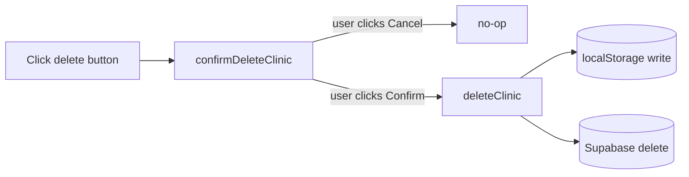
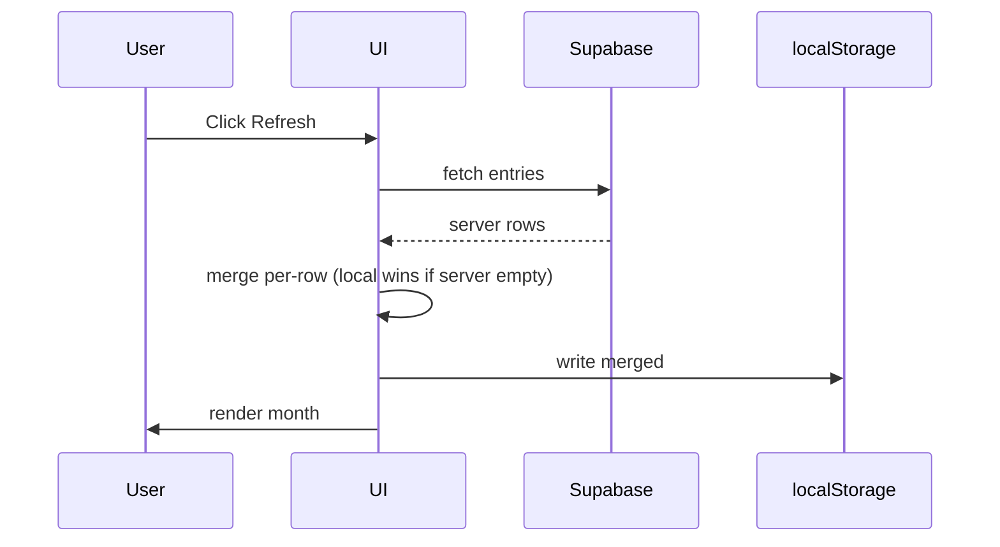

# Explain Before Edit

A discipline gate. Before any code edit, stop, explain, draw the change against the codebase, and wait for explicit approval. The cost of one extra exchange is low; the cost of an unwanted edit to a single-file HTML app with no test suite is high.

## When to invoke

- **Proactively, before any tool call** that would Write, Edit, or modify a file in this repo (`index.html`, `README.md`, `CODEX.md`, `supabase_schema.sql`, anything under `.claude/skills/`).
- Includes "small" edits — typo fixes, color tweaks, one-line guards. The preview shrinks accordingly; it doesn't disappear.
- Also runs after a debugging session that has landed a candidate fix and you're about to apply it.

## When to skip

Only when the user has **explicitly** opted out for this turn or this session:

- "just do it" / "skip the preview" / "no need to explain" / "go ahead"
- "ลุยเลย" / "ทำเลย" / "ไม่ต้องอธิบาย"
- The user is in a tight back-and-forth loop applying the user's own dictated edits verbatim (you are a transcriber, not an author).

If you are unsure whether the user opted out, **don't skip**. One extra exchange is cheaper than one unwanted edit.

## The four-block preview

Produce this as a single chat block before any edit. Keep it tight — this is a preview, not a proposal document.

### 1. What
One sentence. The change in user/code terms, whichever is more concrete. Example: *"Add a confirm-before-delete modal to the clinic-delete button in `index.html`."*

### 2. Why
One or two sentences. Why this change, and — if it's not the obvious approach — one mention of the simpler alternative you considered and rejected. If a simpler alternative exists and is better, **stop and surface that instead of drafting the original change.** (This is the [`scrutinize`](../scrutinize/SKILL.md) step-1 reflex carried into edits.)

### 3. Step-by-step
Numbered list of the actual edits, in order. Each step names the file and the function / section / line range and what changes. Examples:

1. `index.html` — add `confirmDeleteClinic(id)` helper above `deleteClinic()`.
2. `index.html` — change the clinic row's delete button `onclick` from `deleteClinic(id)` to `confirmDeleteClinic(id)`.
3. `index.html` — add the confirm-modal markup at the end of the modal section (near the existing patient-edit modal).

No prose paragraphs. The list is the plan.

### 4. Diagram — pick the shape that matches the change

Pick **one** of two formats based on what the change actually is. Don't draw both.

**ASCII tree** — use when the change is about *structure*: which files / sections / functions exist or move. Annotate the touched nodes with `<-- new` / `<-- modify` / `<-- delete` / `<-- rename`.

```
index.html
  ├─ <head>
  ├─ <body>
  │   ├─ Calendar section
  │   ├─ Clinic management section
  │   │   ├─ renderClinicList()
  │   │   ├─ deleteClinic(id)           <-- modify: now calls confirmDeleteClinic
  │   │   └─ confirmDeleteClinic(id)    <-- new
  │   └─ Modals
  │       └─ <div id="confirmDelete">   <-- new
  └─ <script>
```

**Mermaid** — use when the change is about *flow*: which function calls which, what events fire in what order, how state mutates across a click-path or sync. Wrap in a ` ```mermaid ` block. Examples:





**How to pick:**
- New / moved / renamed / deleted files or sections → **ASCII tree**.
- New function calls, new event handlers, new sync sequence, state-mutation order → **Mermaid flowchart or sequence**.
- Pure rename / refactor with no behavior change → **ASCII tree** (the structure is the story).
- Data shape change (new field in `entries` / `clinics` / a Supabase column) → **ASCII tree** showing before/after shape, or a small Mermaid `classDiagram` if relationships matter.

If the change genuinely has no structural or flow content (e.g., a copy-text fix, a color swap), say so and **show the literal one-line diff instead of a diagram**:

```
- background: #fff;
+ background: #e0f0ff;
```

Don't manufacture a diagram for a change that doesn't need one.

## Approval gate

After the four-block preview, end with a single explicit question:

> **Apply this?** ✋ Waiting for your go-ahead before I edit any files.
> (ok / go / ตกลง / ลุย = apply · or tell me what to change)

Then **stop**. Do not call Write / Edit / NotebookEdit until the user replies with explicit approval.

### What counts as approval

- "ok" / "okay" / "go" / "yes" / "do it" / "apply" / "ship it" / "lgtm"
- "ตกลง" / "ลุย" / "เอาเลย" / "ทำเลย" / "โอเค"
- A direct command like "apply step 2 only" — partial approval is fine, apply only the approved steps.

### What does NOT count as approval

- "looks interesting" / "hmm" / "I see" — not a green light.
- Questions about the plan — answer them, then re-ask the gate.
- Silence — wait.
- Approval of a different earlier change in the conversation — each preview has its own gate.

### If the user pushes back

Revise the preview in place — same four blocks, updated. Re-ask the gate. Don't apply a half-revised plan.

## Operating rules

- **Never edit before explicit approval.** This is the whole point of the skill.
- **Never bundle changes the user didn't approve** with changes they did. If you notice a fix you want to make while applying, surface it as a new preview after the approved edits land — don't sneak it in.
- **Don't skip the gate for "this is obviously safe."** Obviousness is exactly when surprises happen.
- **Match the diagram to the change, not the change to the diagram.** If neither ASCII nor Mermaid fits, a one-line diff or a tiny before/after table is fine — the goal is *the user sees what's about to happen*, not diagram ceremony.
- **Keep previews short.** Four blocks, no preamble, no "let me know if you have any questions." The gate is the question.
- **Honor a session-level opt-out.** If the user says "stop showing me previews for the rest of this session," skip the gate for subsequent edits in this conversation. Re-engage if they re-engage with a new edit topic later.
- **This skill pairs with the rest of the engineering set:**
  - [`scrutinize`](../scrutinize/SKILL.md) — if you're previewing your own draft, run a scrutinize pass first; the preview's *Why* block carries the simpler-alternative answer.
  - [`debug-mantra`](../debug-mantra/SKILL.md) → fix → **explain-before-edit** → apply → [`post-mortem`](../post-mortem/SKILL.md) → [`management-talk`](../../productivity/management-talk/SKILL.md) — the full flow when a bug becomes a documented, user-visible change.

## Worked example

User: *"Add a delete-confirmation modal for the clinic list."*

Preview:

> **What.** Add a confirm-before-delete modal to the clinic-delete button in `index.html`.
>
> **Why.** Right now `deleteClinic(id)` runs on a single tap with no confirmation — easy to misfire on mobile, and the action is destructive (also deletes the clinic's history rows). Simpler alternative considered: `window.confirm()` native dialog. Rejected because the rest of the app uses custom modals and the native dialog looks out of place on iPhone home-screen launch.
>
> **Step-by-step.**
> 1. `index.html` — add `confirmDeleteClinic(id)` helper above `deleteClinic()`. Opens the modal and stores the pending id.
> 2. `index.html` — change the clinic row's delete button `onclick` from `deleteClinic(id)` to `confirmDeleteClinic(id)`.
> 3. `index.html` — add the confirm-modal markup near the existing patient-edit modal. Two buttons: Cancel (close), Confirm (calls `deleteClinic(pendingId)` then closes).
>
> **Diagram.**
> ```mermaid
> flowchart LR
>     btn[Click delete on clinic row] --> conf[confirmDeleteClinic id]
>     conf --> modal[Modal: Cancel / Confirm]
>     modal -->|Cancel| nop[close modal]
>     modal -->|Confirm| del[deleteClinic id]
>     del --> ls[(localStorage)]
>     del --> sb[(Supabase)]
> ```
>
> **Apply this?** ✋ Waiting for your go-ahead before I edit any files.
> (ok / go / ตกลง / ลุย = apply · or tell me what to change)

Then stop. Wait.
